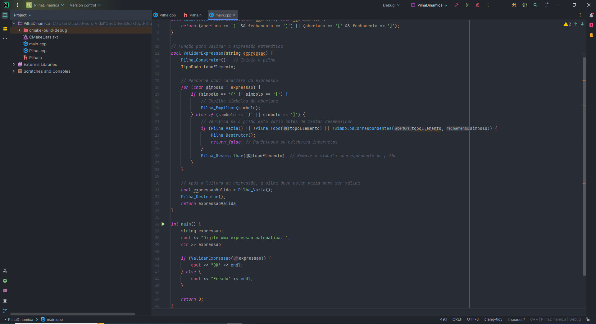

<h1 align="center"> Pilha Dinâmica </h1>

Este projeto é a resolução de um exercício da matéria Algorítmos e Estruturas de Dados 

  <a href="#-tecnologias">Tecnologias</a>&nbsp;&nbsp;&nbsp;|&nbsp;&nbsp;&nbsp;
  <a href="#-projeto">Projeto</a>&nbsp;&nbsp;&nbsp;&nbsp;&nbsp;&nbsp;

 

  

## 🚀 Tecnologias

Esse projeto foi desenvolvido com as seguintes tecnologias:

- C++
- Github

## 💻 Projeto

O PilhaDinamica é apenas uma resolução de um exercício

---

